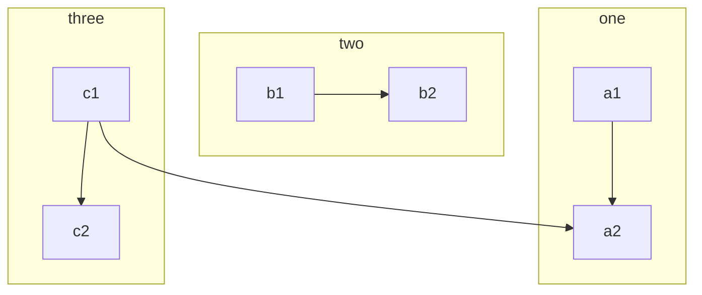

# Mermaid

    ```mermaid
    graph TB
        c1-->a2
        subgraph one
        a1-->a2
        end
        subgraph two
        b1-->b2
        end
        subgraph three
        c1-->c2
        end
    ```



```tip
The theme chooses the latest mermaid version by default, if you want to use the latest version via npm, add following configuration to your `_config.yml`
```

```yml
mermaid:
  src: https://cdn.jsdelivr.net/npm/mermaid/dist/mermaid.min.js
```

Mermaid documentation, see: [https://mermaid-js.github.io/mermaid/](https://mermaid-js.github.io/mermaid/)
